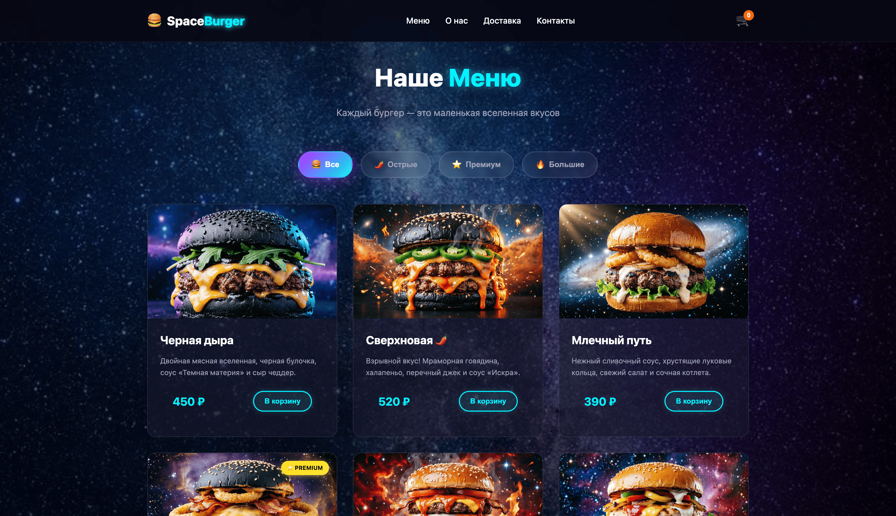

# 🍔 Space Burger — Космическая бургерная



**Space Burger** — это современный одностраничный сайт-магазин бургерной с футуристичным космическим дизайном, полноценной корзиной и умной валидацией форм. Проект написан на чистом HTML, CSS и JavaScript без использования сторонних фреймворков.

[🚀 Посмотреть демо]((https://ar4i23.github.io/space_burger/)) • [📦 Установка](#-установка) • [⚡ Функционал](#-функционал)

---

## ⚡ Функционал

### 🍔 Меню и каталог

- **6 уникальных бургеров** с космическими названиями и описаниями.
- **Фильтрация по категориям**: Все, Острые, Премиум, Большие.
- **Адаптивные изображения** с использованием `srcset` (3 размера для каждого бургера) для быстрой загрузки на любых устройствах.
- **Плавные анимации** появления и скрытия карточек при фильтрации.

### 🛒 Корзина

- Добавление и удаление товаров, изменение количества.
- Автоматический подсчет итоговой суммы.
- **Сохранение состояния** в `localStorage` (корзина не теряется при обновлении страницы).
- Всплывающие уведомления (Toast) при добавлении товара.

### 📝 Оформление заказа

- Форма с полями: имя, телефон, адрес, комментарий.
- **Валидация в реальном времени** с визуальной обратной связью:
  - ✅ Зеленое свечение при правильном вводе.
  - ❌ Красная анимация тряски при ошибке.
- Проверка формата телефона (+7/8) и адреса (буквы + цифры).
- Анимация загрузки при отправке и экран успеха с летящей ракетой.

### 🌌 Дизайн и UX

- Анимированный космический фон с эффектом плавного зума.
- Неоновые акценты, свечение элементов и glassmorphism (эффект матового стекла).
- Полная адаптивность под мобильные устройства, планшеты и десктоп.
- Мобильное меню с анимацией превращения в крестик.
- Секция "Доставка" с космической картой-заглушкой и зонами доставки.

---

## 🚀 Технологии

| Технология     | Назначение                                                     |
| :------------- | :------------------------------------------------------------- |
| **HTML5**      | Семантическая разметка, SEO-оптимизация, микроразметка JSON-LD |
| **CSS3**       | CSS Grid, Flexbox, CSS-переменные, анимации, адаптивность      |
| **JavaScript** | ES6+, работа с DOM, валидация форм, `localStorage`             |
| **BEM**        | Методология именования классов для масштабируемости CSS        |

---

## Структура проекта

```text
space-burger/
├── index.html              # Главная страница
├── css/
│   └── style.css           # Все стили (БЭМ, адаптивность)
├── js/
│   ── script.js           # Вся логика (корзина, валидация, фильтры)
── img/
│   ├── space-bg.jpg        # Космический фон
│   ├── burger-blackhole-*.png  # Бургер "Черная дыра" (3 размера)
│   ├── burger-supernova-*.png  # Бургер "Сверхновая" (3 размера)
│   ├── burger-milkyway-*.png   # Бургер "Млечный путь" (3 размера)
│   ├── burger-saturn-*.png     # Бургер "Сатурн" (3 размера)
│   ├── burger-redgiant-*.png   # Бургер "Красный гигант" (3 размера)
│   ├── burger-nebula-*.png     # Бургер "Туманность" (3 размера)
│   ── preview.png         # Превью для README
└── README.md               # Документация проекта
```
